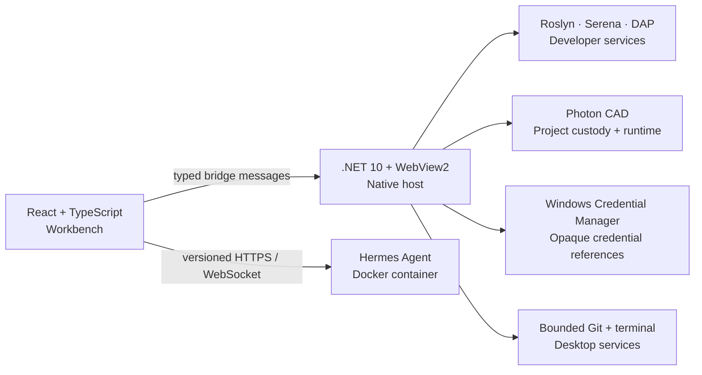

<p align="center">
  
</p>

<p align="center">
  <strong>One adaptive Windows workbench for AI agents, code intelligence, debugging, and precision engineering.</strong>
</p>

<p align="center">
  React 19 &nbsp;·&nbsp; TypeScript &nbsp;·&nbsp; .NET 10 &nbsp;·&nbsp; WebView2 &nbsp;·&nbsp; Docker &nbsp;·&nbsp; Roslyn &nbsp;·&nbsp; Serena
</p>

<p align="center">
  <a href="docs/ROADMAP.md">Roadmap</a> ·
  <a href="docs/HERMES-FUNCTION-PARITY.md">Capability matrix</a> ·
  <a href="remote-install/README.md">Portable installation</a> ·
  <a href="docs/HERMES-CONVERSATION-BRIDGE.md">Bridge protocol</a>
</p>

---

Photon turns [Hermes Agent](https://github.com/NousResearch/hermes-agent) into a cohesive, desktop-grade engineering environment. It combines an autonomous agent workspace with native developer services, operational intelligence, source control, and an emerging CAD platform—without flattening everything into one privileged process.

The application is internally named **Photos Agape Aphthartos**; **Photon** is its public-facing identity and default assistant name. Hermes remains the isolated agent runtime and upstream compatibility boundary.

> **Development preview:** Photon is under active construction. The repository contains working product surfaces, focused smoke suites, and portable-delivery tooling, but it is not yet presented as a finished general-availability release.

## Built for serious engineering work

| | Capability |
|---|---|
| **Agent workspace** | Durable Hermes conversations, prompt queuing, approvals, attachments, session search, safe Markdown, model controls, bounded reconnect, and an optional side-by-side Codex session. |
| **Code intelligence** | Monaco editing, workspace search, Roslyn language services, Serena semantic discovery, diagnostics, Problems and Output views, guarded builds, and a fixed .NET DAP debugger provider. |
| **Photon CAD** | A native project-custody and runtime foundation for deterministic previews, Windows project workflows, assembly/geometry artifacts, and an explicitly gated industrial-provider seam. |
| **Operational clarity** | Provider-neutral Usage Intelligence, per-profile attribution, live/synthetic provenance, health surfaces, notification history, and explicit unavailable or partial-failure states. |
| **Desktop integration** | A thin .NET 10 WebView2 host brokers native terminal, credentials, Git, developer services, and local project operations through narrow typed contracts. |
| **Portable delivery** | A self-contained Windows host, verified installer bundle, immutable Hermes image policy, explicit updates, health checks, and automatic one-image rollback. |

## Architecture with boundaries

Photon is designed as a set of cooperating capability lanes. The React renderer owns presentation and typed intents; privileged operations stay behind the native host or inside the isolated runtime that owns them.



- **Renderer:** adaptive React interface, typed state, bounded user input, no direct credential access.
- **Native host:** fixed capability broker for Windows-only operations and native secret storage.
- **Hermes runtime:** separately updateable Docker workload with preserved upstream identity and rollback.
- **Developer services:** purpose-built Roslyn, Serena, debugger, build, and diagnostics adapters—no generic renderer-provided command surface.

## Start Photon

### Requirements

- Windows 10 or Windows 11
- Docker Desktop
- Git with submodule support
- Node.js and the .NET 10 SDK only when building from source

### Run the packaged workspace

```powershell
git clone --recurse-submodules https://github.com/csorrells42/Photon.git
cd .\Photon
& '.\Launch Hermes.cmd'
```

The launcher starts Docker Desktop when needed, validates reserved loopback ports, supervises the Hermes container and Serena service, waits for readiness, and opens the native Photon window. Use `Check Hermes.cmd`, `Update Hermes.cmd`, and `Shutdown Hermes.cmd` for the matching read-only health, explicit update, and owned-process shutdown flows.

Sign in from **Settings → Account** so the WebView2 profile can reconnect chat, sessions, and system state together. The browser view at <http://127.0.0.1:4173> intentionally operates with reduced native capabilities.

For clean-machine installation and bundle verification, follow the [portable installation guide](remote-install/README.md).

## Develop and verify

```powershell
cd .\src
npm test
npm run build
dotnet build .\Host\HermesDesktop\HermesDesktop.csproj -c Release
dotnet run --project .\Host\HermesDesktop.Smoke\HermesDesktop.Smoke.csproj -c Release
dotnet run --project .\Host\HermesDeveloperServices.Smoke\HermesDeveloperServices.Smoke.csproj -c Release
```

Focused suites cover the renderer controllers and adapters, native protocol boundaries, credential sanitization, conversation bridging, Roslyn/LSP and DAP flows, Git services, Photon CAD custody/runtime layers, portable installer verification, and deterministic fake-provider behavior. Live runtime or hardware evidence is kept separate from unit and smoke evidence.

## Repository map

| Path | Purpose |
|---|---|
| [`src/`](src/) | React/TypeScript Workbench, isolated feature modules, and native .NET host/services. |
| [`source/`](source/) | Pinned Hermes Agent submodule preserving Nous Research history and the upstream MIT license. |
| [`docs/`](docs/) | Architecture, provider research, parity evidence, roadmap, and coordination handoffs. |
| [`remote-install/`](remote-install/) | Portable installation, verification, launch, update, and shutdown tooling. |
| [`workspace/`](workspace/) | Portable user workspace mounted into Hermes separately from runtime credentials and state. |

The local `data/` directory contains runtime state and credentials. It is intentionally excluded from packages and source control.

## Design principles

1. **Typed seams over ambient privilege.** Every native operation begins with a bounded, explicit contract.
2. **Honest provenance.** Live, synthetic, unavailable, partial, and staged evidence remain visibly distinct.
3. **Upstream-friendly isolation.** Hermes can advance independently behind reviewed compatibility and rollback gates.
4. **No silent replay.** Reconnect and recovery never resubmit a user prompt without a fresh user decision.
5. **Portable without portable secrets.** Bundles may describe credential requirements, but never carry user- or machine-bound credentials.

## Project documentation

- [Roadmap and current delivery sequence](docs/ROADMAP.md)
- [Hermes capability and compatibility matrix](docs/HERMES-FUNCTION-PARITY.md)
- [Usage Intelligence provider research](docs/USAGE-INTELLIGENCE-PROVIDERS.md)
- [Serena and Roslyn responsibility map](docs/SERENA-ROSLYN-RESPONSIBILITY-MAP.md)
- [Loopback conversation bridge](docs/HERMES-CONVERSATION-BRIDGE.md)
- [Portable installer walkthrough](remote-install/README.md)

## License and attribution

Photon's original Workbench code is licensed under [Apache License 2.0](LICENSE). The pinned Hermes Agent source retains its upstream [MIT license](source/LICENSE) and Nous Research attribution. Third-party components retain their respective licenses and notices; see [NOTICE](NOTICE).

---

<p align="center">
  <strong>Photon</strong><br />
  A focused environment where agents, code, and engineered systems meet.
</p>
